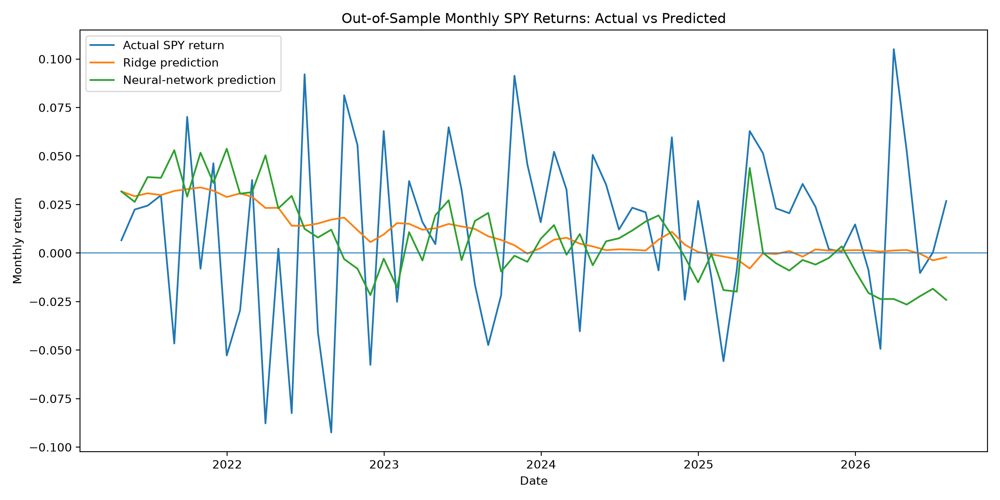
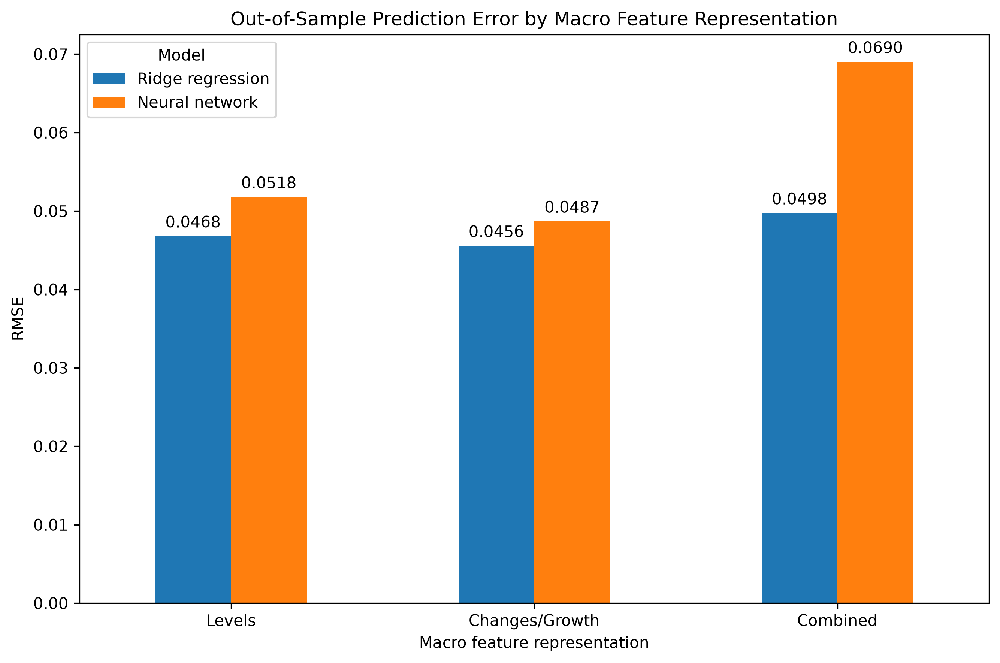
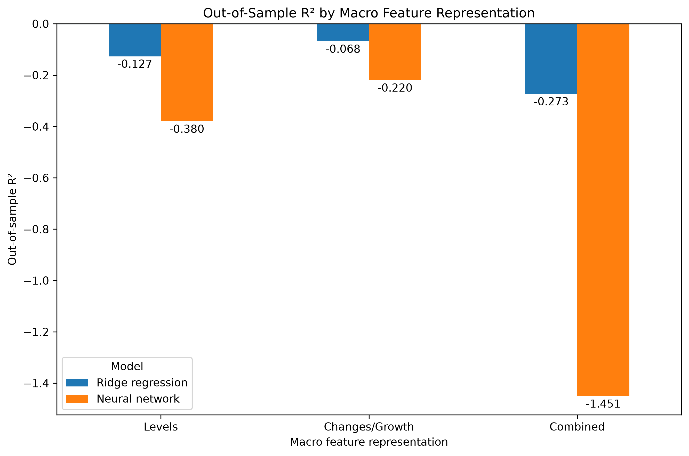
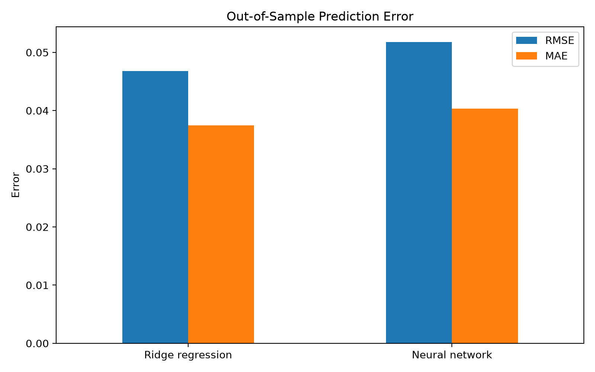

# Multi-Source Data Platform

A locally deployed, automated data platform that integrates multiple public data sources through **Apache Airflow, Python, PostgreSQL, Docker, dimensional modeling, automated data-quality checks, GitHub Actions CI/CD, and downstream statistical/machine-learning analysis**.

The project uses public financial and macroeconomic data to reproduce the core engineering pattern of a production analytical data platform.

## Architecture

```text
FRED ─────┐
Yahoo ────┼──→ Apache Airflow ─→ Python ingestion ─→ PostgreSQL
Tiingo ───┘                                      │
                                                 ↓
                                      RAW → STAGING → CURATED
                                                          │
                                            ┌─────────────┴─────────────┐
                                            ↓                           ↓
                                    Data-quality tests          Analytical dataset
                                                                        ↓
                                                          Ridge vs Neural Network
```

The software-delivery layer surrounds the data pipeline:

```text
Development
    ↓
Git / GitHub
    ↓
GitHub Actions
    ├── CI → reconstruct and validate
    └── CD → build and publish Docker image
                         ↓
              GitHub Container Registry
```

## What the Platform Does

The platform ingests data from three independent APIs:

- **FRED** — macroeconomic indicators including the federal funds rate, CPI, unemployment, Treasury yields, industrial production, payroll employment, and M2.
- **Yahoo Finance** — daily SPY, QQQ, and VIX market observations.
- **Tiingo** — an independent source of SPY and QQQ market data.

Apache Airflow orchestrates ingestion, transformation, dependency management, and automated quality testing.

PostgreSQL separates the data into three analytical layers:

**Raw** preserves source-level observations.

**Staging** standardizes heterogeneous market data into a common structure.

**Curated** provides analysis-ready dimensional models for downstream use.

## Curated Data Model

The curated layer contains separate market and macroeconomic fact tables sharing a common date dimension:

```text
                    dim_date
                       │
             ┌─────────┴─────────┐
             ↓                   ↓
        fact_market          fact_macro
             │                   │
        dim_asset        dim_macro_series
```

This preserves the different grains of the two domains:

- `fact_market`: date × asset × source
- `fact_macro`: date × macroeconomic series

The design avoids forcing fundamentally different observations into a single fact table.

## Data Quality

Automated tests validate key properties of the curated data, including:

- non-null dimensional keys;
- valid market prices;
- expected macroeconomic-series coverage;
- structural consistency of analysis-ready tables.

The data-quality task is part of the Airflow dependency graph, so validation occurs after the required curated tables have been constructed.

## End-to-End Orchestration

The completed Airflow workflow executes:

```text
API ingestion
    ↓
Raw PostgreSQL tables
    ↓
Staging transformation
    ↓
Curated market + macro models
    ↓
Automated data-quality tests
    ↓
Successful pipeline run
```

The three source ingestions can execute independently before downstream dependencies converge.

## Analytical Question

The platform terminates in a genuine analytical use case rather than treating machine learning as a separate exercise.

The question tested was:

> **Can current financial-market conditions and lagged macroeconomic indicators predict subsequent S&P 500 returns, and does a nonlinear neural network add predictive value over a conventional statistical model?**

The target is **next-month SPY return**.

Predictors include current market return, market volatility, VIX, and lagged macroeconomic indicators.

A chronological **80/20 train-test split** is used rather than randomly splitting the time series.

Two models are compared:

1. Ridge regression
2. A small PyTorch feed-forward neural network

## Results

The analytical dataset contained **318 monthly observations**, with 254 observations used for training and 64 for out-of-sample testing.

| Model | RMSE | MAE | Out-of-sample R² |
|---|---:|---:|---:|
| Ridge regression | 0.0468 | 0.0374 | -0.127 |
| Neural network | 0.0518 | 0.0404 | -0.380 |

The neural network **did not outperform** the simpler regularized model.

Both models produced negative out-of-sample R², indicating that neither provided strong predictive performance relative to a simple benchmark over the test period.

The result is useful precisely because model complexity was evaluated empirically rather than assumed to improve performance. With approximately 300 monthly observations and a noisy financial-return target, the neural network added complexity without demonstrating incremental predictive value.

### Actual vs. predicted returns



## Feature Representation Sensitivity

The baseline analysis above used lagged macroeconomic **levels**. That raised a second question: would the models perform differently if macroeconomic conditions were represented by what was **changing**, rather than primarily by their levels?

I therefore re-expressed the macroeconomic predictors while leaving the rest of the analytical structure unchanged.

For the federal funds rate, unemployment rate, and 10-year Treasury yield, I used monthly first differences. For CPI, industrial production, payroll employment, and M2, I used monthly log growth rates. These transformed variables were again lagged by one month.

I then compared three specifications:

1. **Levels** — the original lagged macroeconomic levels;
2. **Changes/Growth** — lagged changes in rates and lagged growth rates for the quantity/index variables;
3. **Combined** — both levels and changes/growth.

The market predictors, chronological train-test split, Ridge specification, and neural-network architecture were otherwise unchanged.

| Specification | Model | RMSE | MAE | Out-of-sample R² |
|---|---|---:|---:|---:|
| Levels | Ridge regression | 0.046811 | 0.037427 | -0.126650 |
| Levels | Neural network | 0.051809 | 0.040361 | -0.380087 |
| Changes/Growth | Ridge regression | **0.045586** | 0.037454 | **-0.068429** |
| Changes/Growth | Neural network | **0.048705** | **0.039631** | **-0.219672** |
| Combined | Ridge regression | 0.049763 | 0.041374 | -0.273196 |
| Combined | Neural network | 0.069040 | 0.050213 | -1.450714 |

Representing macroeconomic conditions as **changes or growth rates improved out-of-sample performance for both models** relative to using levels.

For Ridge regression, RMSE declined from 0.0468 to 0.0456 and out-of-sample R² improved from -0.127 to -0.068. The neural network also improved: RMSE declined from 0.0518 to 0.0487 and R² improved from -0.380 to -0.220.

The improvement did not overturn the original model comparison. **Ridge regression continued to outperform the neural network.**

The combined specification performed worse than either representation alone, particularly for the neural network. Adding both levels and changes increased the feature space without improving generalization.

This provides an additional result from the exercise: **changing how the information was represented helped more than increasing model complexity or simply adding more features.**

At the same time, all out-of-sample R² values remained negative. The changes/growth specification therefore improved relative predictive performance, but the results should not be interpreted as demonstrating a strong forecasting model.

### Prediction error by macro feature representation



The changes/growth specification produced the lowest RMSE for both Ridge regression and the neural network.

### Out-of-sample R² by macro feature representation



The same ordering is visible in out-of-sample R². Changes/growth improved both models, while combining levels and changes degraded performance. All specifications nevertheless remained below zero.

### Out-of-sample error



## CI/CD

GitHub Actions provides automated validation and delivery.

### Continuous Integration

On pushes and pull requests to `main`, GitHub Actions:

1. provisions a clean Ubuntu runner;
2. starts PostgreSQL 16;
3. installs the pinned Python dependencies;
4. reconstructs the database schemas and tables from version-controlled SQL;
5. validates the Python source and Airflow DAG syntax.

### Continuous Delivery

After CI succeeds on `main`, a separate delivery job:

1. builds the custom Airflow Docker image;
2. authenticates with GitHub Container Registry;
3. publishes the validated image with `latest` and commit-specific tags.

Published container:

`multi-source-airflow`

This separates three different forms of operational history:

- **Git/GitHub** — what changed in the source code;
- **Airflow** — what pipeline tasks executed and whether they succeeded;
- **GitHub Actions** — whether each software version passed automated validation and delivery.

## Reproducibility and Secrets

Runtime environments and credentials are deliberately separated from source control.

The repository contains `.env.example` as a configuration template. The real `.env` file is excluded from Git.

Database and API credentials are supplied through environment variables rather than embedded in application code.

Python dependencies are pinned in `requirements.txt`, while Docker Compose defines the local PostgreSQL and Airflow runtime environment.

## Repository Structure

```text
multi-source-data-platform/
├── .github/workflows/     # CI/CD
├── dags/                  # Airflow orchestration
├── docs/images/           # Documentation figures
├── sql/
│   ├── raw/
│   ├── staging/
│   └── curated/
├── src/                   # Ingestion, SQL runner, modeling, plots
├── tests/                 # Automated data-quality tests
├── .env.example
├── Dockerfile
├── docker-compose.yml
├── requirements.txt
└── README.md
```

## Production Health-Data Analogy

The financial data provide a safe public-data analogue for a more general analytical data-platform architecture.

The transferable engineering pattern is:

```text
heterogeneous source systems
        ↓
automated ingestion
        ↓
orchestration
        ↓
standardized staging
        ↓
curated analytical models
        ↓
quality gates
        ↓
downstream analytical consumers
```

In a production clinical environment, this architecture would require additional controls including enterprise IAM/RBAC, network segmentation, secrets management, encryption, audit logging, data classification and de-identification, controlled development environments, lineage, backup/recovery, privacy governance, and applicable data-use approvals.

Clinical interoperability may additionally involve standards such as **HL7 and FHIR**.

Accordingly, this repository demonstrates a **production-style architecture locally**; it does not claim to reproduce the full security and governance environment required for protected health information.

## Limitations and Next Steps

The current implementation intentionally remains compact enough to understand end-to-end.

Important extensions include:

- incremental ingestion/upserts rather than full source refreshes;
- cross-source reconciliation between Yahoo Finance and Tiingo;
- release-date-aware macroeconomic features and ALFRED vintages;
- rolling-origin time-series validation;
- richer monitoring and data-lineage metadata;
- rolling-origin time-series validation;
- enterprise authentication and authorization controls.

A particularly important modeling limitation is that FRED observation dates represent economic reference periods rather than necessarily the information set available to a forecaster on that date. Lagging the macroeconomic variables reduces same-period leakage, but a rigorous real-time forecasting study would use release-date-aware or vintage data.

## Why I Built It

The objective was not simply to build an ETL script or train a neural network.

It was to connect the pieces that sit between heterogeneous source systems and an analytical result:

**ingestion → orchestration → storage → transformation → dimensional modeling → quality control → reproducibility → CI/CD → analysis.**

The resulting platform provides a compact environment for understanding how these components interact as a system.